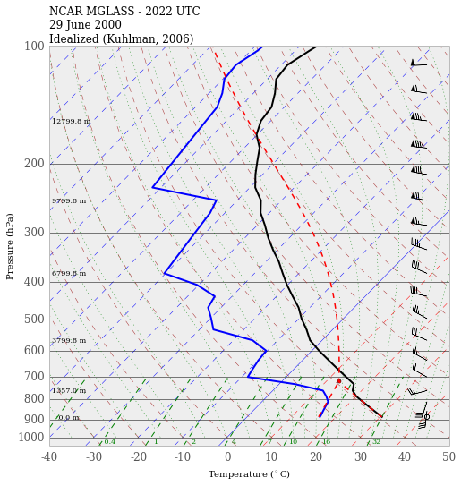

### Supercell simulation

Following the data from [Kuhlman (2006)](http://journals.ametsoc.org/doi/full/10.1175/MWR3217.1), this directory contains the necessary scripts and utilites to set up the CRM to simulate a supercell thunderstorm. The instructions below document the steps necessary to reproduce the initial simulation.

### Setup Directions

1. Run the routine in `make_sounding.ipynb`. This will generate plots of the sounding and its interpolation to the model grid.

2. Previously, the surface $\theta_{il}$ and $q_v$ needed to be hardcoded into the model file, `initial.F90`. That should no longer be necessary.

3. Update the `start_new` file with the appropriate settings for model configuration including domain size, resolution, etc.

4. Run either the notebook `setup_crm_3d.ipynb` or `setup_crm_2d.ipynb`, noting to change the root directory of the model in the final cell. It will copy the following files to the appropriate place:
    - supercell_init (the model initial profile)
    - a default chemistry profile
    - cm2d.nml or cm3d.nml
    - start_supercell

5. Navigate to the given model root directory, and execute `start_supercell` to run the model.

#### Example sounding
