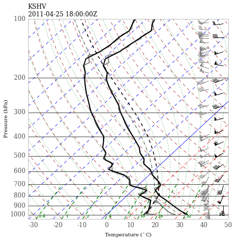

### April 25, 2011 Convective Outbreak

During the afternoon and evening of April 25, 2011, a series of convective storms moved through Eastern Texas, Louisiana, and Arkansas, producing significant winds, hail, and some isolated tornadoes. The anvil outflow of this convective system was sampled by a flight conducted as part of the MACPEX field campaign, and is the focus of some research into aerosol-convection interactions at MIT.

### Setup Directions

1. Modify the script `start_kshv`, which contains the script for actually running the model, and controls some deep-model configuration settings.

2. Run the routine in `setup_crm_Nd.ipynb`, where N indicates the dimensionality of your model run. You can set the configurations for the model in this script. It will produce `nml` namelist file, a chemistry and meteorology initial profile, and copy the `start_kshv` script into the appropriately set model home folder.

3. Navigate to the given model root directory, and execute `start_kshv` to run the model.

#### Model initial sounding

Note that two profiles are plotted here. The lighter gray curves and barbs are the raw sounding profile data. The sounding used in the model simulation has been colored in black. It was generated by linearly interpolating the sounding data to a 500m vertical grid. In the lower part of the model, the surface $q_v$ was tweaked to ensure a near-isothermal profile with respect to mixing ratio. Additionally, the surface temperature was warmed by 5 degrees C, and integrated dry adiabatically to 2 kilometers. The net effect here is to triple the amount of CAPE to about 1600 J/kg, while limiting CIN to less than 10 J/kg.